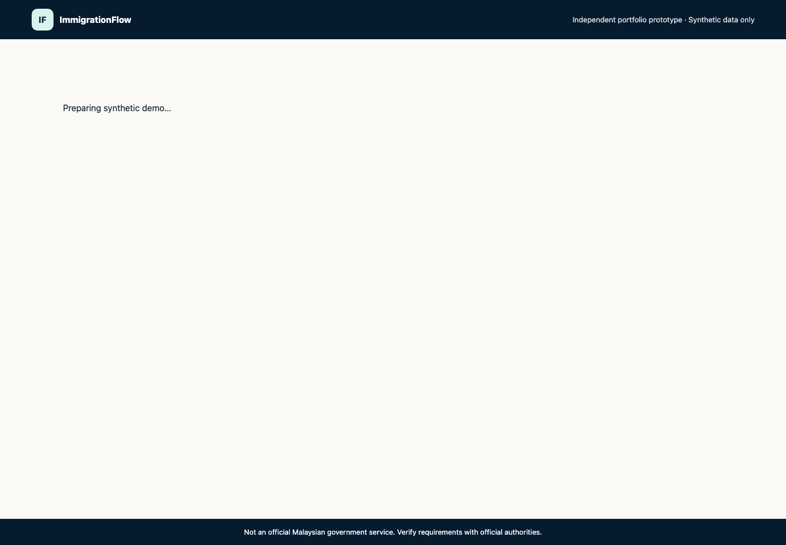
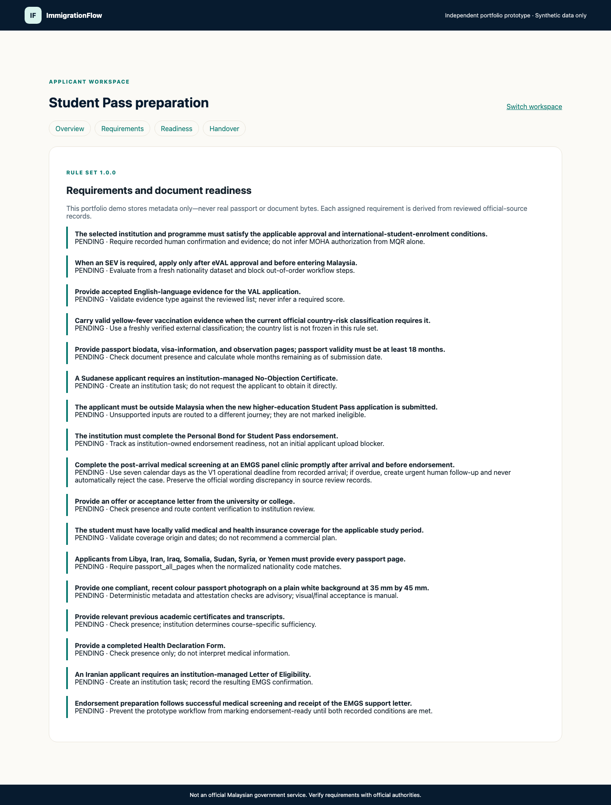
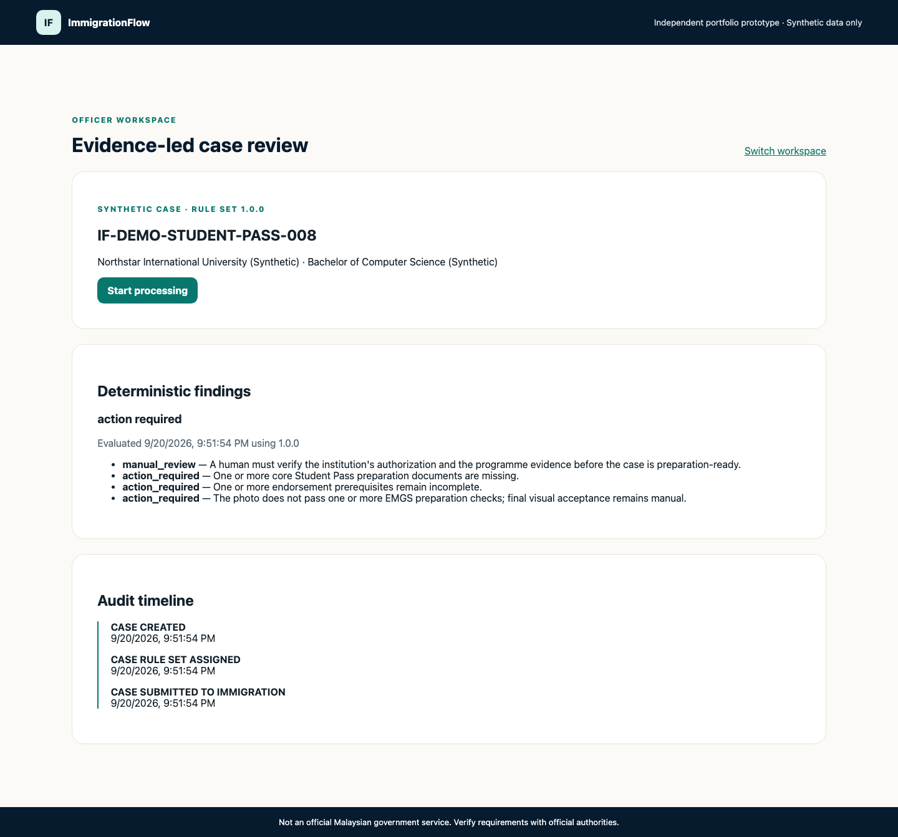

# ImmigrationFlow

An official-source-grounded, AI-assisted immigration case management platform for Malaysia.

ImmigrationFlow is a long-term portfolio project. Its delivered first vertical demonstrates Student Pass preparation and formal handover from applicant and officer perspectives. The platform architecture can support later services without pretending that V1 covers Graduate Pass, employment pathways, or the entire immigration system.

## Product principles

- Build one end-to-end journey deeply before expanding horizontally.
- Ground guidance in traceable, versioned official sources.
- Keep deterministic eligibility and document rules separate from generative AI.
- Use AI for explanation, extraction, and triage—not final immigration decisions.
- Protect personal data and make officer actions auditable.
- Clearly label prototypes, assumptions, stale sources, and unsupported cases.

## Initial scope

The first vertical is:

`International student → Student Pass preparation → Graduation → Graduate Pass / employment-pathway preparation`

See [docs/PROJECT_SCOPE.md](docs/PROJECT_SCOPE.md) for boundaries and success criteria.

## Repository map

```text
apps/
  immigration-flow-web/ Unified Applicant and Officer React application
backend/               Shared APIs and domain services
data/
  official-sources/    Source registry and captured source metadata
  rules/               Versioned, deterministic rules
  demo/                Synthetic demo fixtures only
docs/
  api/                  API contracts
  architecture/         System design
    decisions/          Architecture decision records
  research/             Research notes with provenance
tests/                  Cross-application and acceptance tests
```

## Status

The Student Pass V1 browser demo is delivered. It combines the bounded official-knowledge package, Phase 2A logical model, Phase 2B backend vertical, and Phase 3 Applicant/Officer experience. The backend includes PostgreSQL migrations through revision 0009, immutable source, rule, assignment, evaluation, finding, event, and audit history; deterministic bundle validation and rule execution; atomic synchronization; administrator review; timed activation; rule preview before handover; assignment at the server-recorded handover boundary; submission-cutoff reassessment; and automated tests.

The unified web app demonstrates a synthetic Applicant requirements/readiness/handover path and an Officer queue/review/timeline path. It uses a demo-only actor header and is not production authentication. The knowledge pipeline and document endpoint store reviewed metadata and synthetic fixtures only—they do not store real applicant data or sensitive file bytes.

## Demo

```bash
make demo
```

Open `http://127.0.0.1:4173`. See the [demo guide](docs/DEMO_GUIDE.md) for the walkthrough, reset behavior, testing, and production gaps.



| Applicant requirements | Officer evidence timeline |
| --- | --- |
|  |  |

Additional evidence: [Applicant readiness](docs/assets/demo/applicant-readiness-desktop.png), [Officer queue](docs/assets/demo/officer-queue-desktop.png), and [Applicant mobile view](docs/assets/demo/applicant-overview-mobile.png).

Start with the [Phase 2A design specification](docs/superpowers/specs/2026-08-30-phase-2a-erd-design.md), then review the [logical ERD](docs/architecture/STUDENT_PASS_V1_ERD.md), [data dictionary](docs/architecture/STUDENT_PASS_V1_DATA_DICTIONARY.md), [knowledge operations](docs/KNOWLEDGE_OPERATIONS.md), the [Phase 2B.2D evaluation design](docs/superpowers/specs/2026-09-18-phase-2b-2d-evaluation-reassessment-design.md), and [backend setup guide](backend/README.md).

## Getting started

Read [CONTRIBUTING.md](CONTRIBUTING.md), the [demo guide](docs/DEMO_GUIDE.md), [architecture summary](docs/architecture/PHASE_3_PORTFOLIO_DEMO.md), [backend setup guide](backend/README.md), and [knowledge operations](docs/KNOWLEDGE_OPERATIONS.md). Future work begins with production authentication/authorization and operational safeguards—not broader visa coverage or claims of official integration.

## Disclaimer

This is an independent portfolio project, not an official Malaysian government service or legal-advice product. Users must verify requirements with the relevant authorities and official sources.
