# Student Pass V1 Logical ERD

**Phase:** 2A  
**Database implementation:** Deferred to Phase 2B

This diagram describes logical relationships. It deliberately omits physical PostgreSQL types, indexes, and migration details.

```mermaid
erDiagram
    ACTOR ||--o| APPLICANT_PROFILE : represents
    INSTITUTION ||--o{ PROGRAMME : offers
    APPLICANT_PROFILE ||--o{ CASE : owns
    ACTOR ||--o{ CASE : creates
    ACTOR ||--o{ CASE : is_assigned
    CASE ||--|| STUDENT_PASS_CASE_PROFILE : specializes
    PROGRAMME ||--o{ STUDENT_PASS_CASE_PROFILE : selected_for
    INSTITUTION ||--o{ STUDENT_PASS_CASE_PROFILE : manages

    CASE ||--o{ CASE_STATUS_HISTORY : changes_status
    CASE ||--o{ CASE_EVENT : emits
    CASE ||--o{ AUDIT_EVENT : is_audited

    CASE ||--o{ CASE_SUBMISSION : has
    ACTOR ||--o{ CASE_SUBMISSION : submits
    CASE_SUBMISSION ||--o{ SUBMISSION_DOCUMENT : contains
    DOCUMENT ||--o{ DOCUMENT_VERSION : versions
    DOCUMENT_VERSION ||--o{ SUBMISSION_DOCUMENT : is_locked_in
    DOCUMENT_VERSION ||--o{ DOCUMENT_CHECK : is_checked

    KNOWLEDGE_SOURCE ||--o{ SOURCE_REVISION : has
    REQUIREMENT ||--o{ REQUIREMENT_VERSION : has
    REQUIREMENT_VERSION ||--o{ REQUIREMENT_SOURCE : is_supported_by
    SOURCE_REVISION ||--o{ REQUIREMENT_SOURCE : supports

    RULE_SET ||--o{ RULE_SET_VERSION : has
    RULE_DEFINITION ||--o{ RULE_VERSION : has
    RULE_SET_VERSION ||--o{ RULE_VERSION : contains
    RULE_VERSION ||--o{ RULE_REQUIREMENT : is_supported_by
    REQUIREMENT_VERSION ||--o{ RULE_REQUIREMENT : supports

    RULE_SET_VERSION ||--o{ CASE_SUBMISSION : initially_applies_to
    CASE ||--o{ CASE_RULE_ASSIGNMENT : receives
    CASE_SUBMISSION ||--o{ CASE_RULE_ASSIGNMENT : bases
    RULE_SET_VERSION ||--o{ CASE_RULE_ASSIGNMENT : assigns
    RULE_SET_VERSION ||--o{ CASE : is_current_for
    CASE ||--o{ CASE_REQUIREMENT : materializes
    REQUIREMENT_VERSION ||--o{ CASE_REQUIREMENT : defines
    CASE ||--o{ RULE_EVALUATION : is_evaluated
    RULE_SET_VERSION ||--o{ RULE_EVALUATION : executes
    RULE_EVALUATION ||--o{ EVALUATION_FINDING : produces
    RULE_VERSION ||--o{ EVALUATION_FINDING : explains
    CASE ||--o{ CASE_TASK : requires
    CASE ||--o{ CASE_DEADLINE : tracks

    KNOWLEDGE_SYNC_RUN ||--o{ RULE_SET_VERSION : imports
    RULE_SET_VERSION ||--o{ APPROVAL_EVENT : is_governed_by
    ACTOR ||--o{ APPROVAL_EVENT : decides

    ACTOR {
        uuid id PK
        string actor_type
        string display_name
        timestamp created_at
    }
    APPLICANT_PROFILE {
        uuid id PK
        uuid actor_id FK
        string synthetic_reference
        timestamp created_at
    }
    INSTITUTION {
        uuid id PK
        string institution_code UK
        string name
        string institution_type
    }
    PROGRAMME {
        uuid id PK
        uuid institution_id FK
        string programme_code
        string name
        string level
    }
    CASE {
        uuid id PK
        string case_number UK
        uuid applicant_profile_id FK
        string service_type
        string status
        string stage
        uuid current_rule_set_version_id FK
        integer row_version
    }
    STUDENT_PASS_CASE_PROFILE {
        uuid case_id PK,FK
        uuid institution_id FK
        uuid programme_id FK
        string application_type
        string nationality_code
        timestamp passport_expires_at
        timestamp arrival_at
    }
    CASE_SUBMISSION {
        uuid id PK
        uuid case_id FK
        string submission_type
        timestamp accepted_at
        string immigration_reference
        uuid receipt_document_version_id FK
        uuid applicable_rule_set_version_id FK
    }
    DOCUMENT {
        uuid id PK
        uuid case_id FK
        string document_type
        string status
    }
    DOCUMENT_VERSION {
        uuid id PK
        uuid document_id FK
        integer version_number
        string storage_reference
        string content_hash
        timestamp created_at
    }
    RULE_SET_VERSION {
        uuid id PK
        uuid rule_set_id FK
        string semantic_version
        timestamp published_at
        timestamp effective_at
        timestamp submission_cutoff_at
        string applicability_basis
        string status
        string git_commit_sha
    }
    RULE_EVALUATION {
        uuid id PK
        uuid case_id FK
        uuid rule_set_version_id FK
        string trigger
        json input_snapshot
        string outcome
        timestamp evaluated_at
        uuid supersedes_evaluation_id FK
    }
    CASE_RULE_ASSIGNMENT {
        uuid id PK
        uuid case_id FK
        uuid submission_id FK
        uuid rule_set_version_id FK
        string assignment_reason
        timestamp assigned_at
        uuid supersedes_assignment_id FK
    }
    CASE_DEADLINE {
        uuid id PK
        uuid case_id FK
        string deadline_type
        timestamp starts_at
        integer calendar_days_allowed
        timestamp due_at
        string timezone
        string status
    }
```

## Reading the model

- `case` is reusable platform state; `student_pass_case_profile` contains service-specific facts.
- A confirmed `INITIAL` `case_submission` creates the first `case_rule_assignment`. An approved policy transition may add a superseding assignment for an affected non-final case without overwriting history.
- `document_version` is immutable, and `submission_document` records the exact evidence handed over in each submission.
- Knowledge provenance forms a traceable chain: `source_revision` → `requirement_version` → `rule_version` → `rule_evaluation`.
- Current state is queryable from operational tables; history remains available through append-only status, event, audit, version, and evaluation records.
